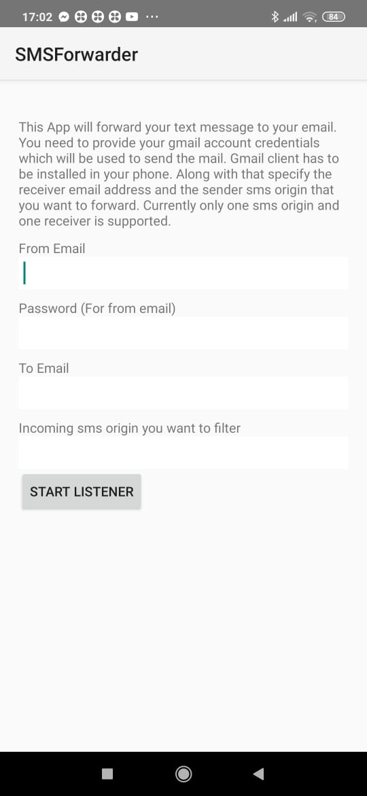

# SMSForwarder

- This is a simple app for Proof of concept which filters and forwards the incoming sms to a specific email.

### IMPORTANT
- The App is designed only for gmail ids.
- This App needs permission to READ SMS. Hence if not prompted, you need to give this permission manually before you run it. 
- You need to enable [less secure app access](https://myaccount.google.com/u/0/lesssecureapps?pli=1&rapt=AEjHL4OYc7vrX4bp5tgoobwsMW6dWOpLYobKY-8gEONcxmYRXaztR96jxWBN7T9kJWCgqdNnIJjwL05Ej-EfzQDSZVzTN30ZZg) for your gmail account.
- SMS listener will stop if you close this App. The app does not run in background.
- Currently only one Sender and one receiver address is supported as a part of POC.

### Home Screen
